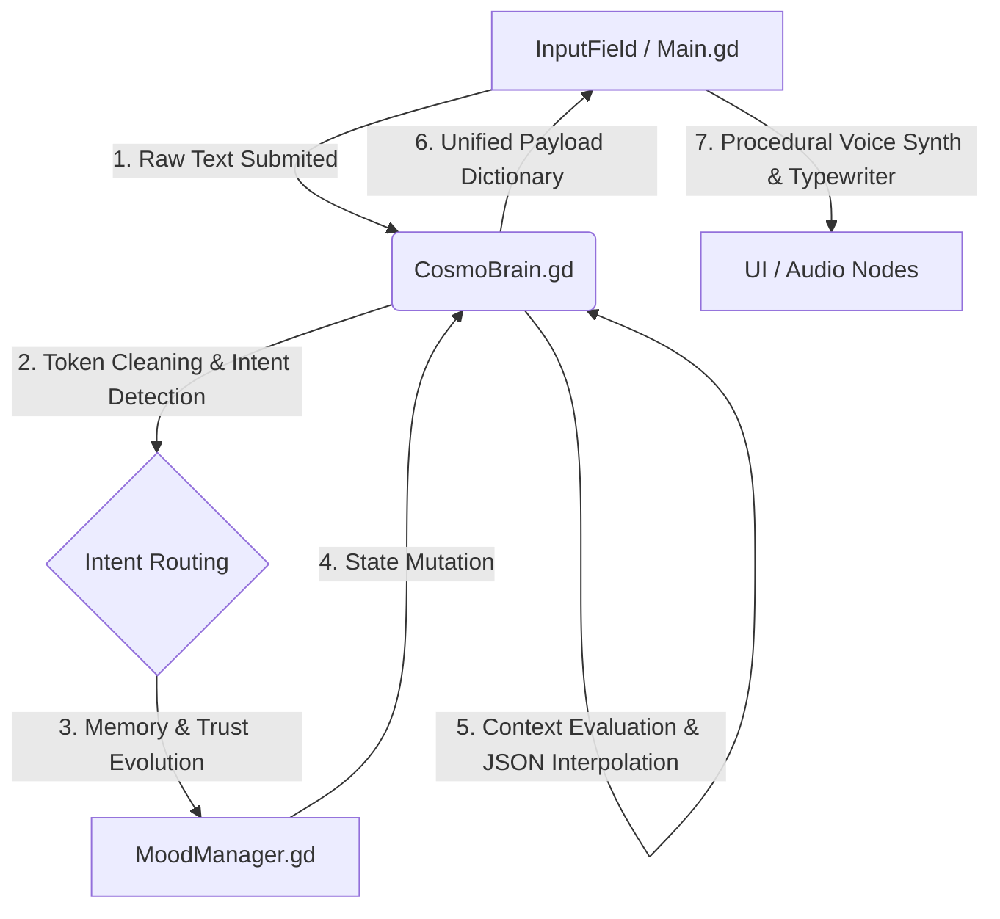

# 🪐 COSMO PROJECT (v0.4-sprint)

[](https://godotengine.org)
[](https://godotengine.org)
[](https://wikipedia.org)

O **COSMO PROJECT** é um ecossistema de Inteligência Artificial Companion offline focado em comportamento emergente, processamento de intenções em tempo de execução e expressividade procedural. O projeto apresenta uma interface facial 2D responsiva e um motor de personalidade sarcástica orquestrado por um pipeline determinístico de dados, projetado especificamente para operar nativamente na **Godot Engine 4.6 (GDScript)**.

---

## 🧠 1. Visão Geral da Arquitetura

O sistema adota uma abordagem **desacoplada e baseada em dados (Data-Driven)**. Ele rejeita estados rígidos em favor de uma cadeia de responsabilidade reativa. O fluxo de execução de um ciclo de input segue estritamente a topologia abaixo:



### 🗂️ Topologia da Cena Principal (`control.tscn`)
```text
Control (Main.gd)
├── VoicePlayer (AudioStreamPlayer) [Síntese senoidal procedural em runtime]
├── BackgroundMusicPlayer (AudioStreamPlayer) [I/O Dinâmico de arquivos .wav]
└── GameContainer (VBoxContainer)
    ├── FaceContainer (CenterContainer) ➔ CosmoFace (AnimatedSprite2D)
    ├── DialogueContainer (PanelContainer) ➔ DialogueLabel [Custom Typewriter]
    └── MusicPlayerPanel (PanelContainer) [Tween-driven Visibility]
        └── HBoxContainer
            ├── Play/Pause/Next (TextureButtons)
            └── CurrentTrackLabel (Label)
```

---

## ⚙️ 2. Mapeamento de Métodos e Contratos de APIs Interoperáveis

### `Main.gd` — Orquestrador de Ciclo de Vida e Apresentação (UI)
*   `_on_input_field_text_submitted(_text: String) -> void`
    *   Tranca a interface de entrada, despacha carga para o `CosmoBrain`, gerencia o estado de animação de pensamento (1.2s *delay* tático) e inicializa o componente de renderização de texto.
*   `execute_cosmo_reaction(speech_text: String, anim_name: String) -> void`
    *   Motor de *typewriter* manual com cálculo dinâmico de *delays* baseados em análise gramatical (pausas acentuadas em tokens `;`, `,`, `.`). Dispara eventos de áudio síncronos.
*   `_setup_procedural_voice() -> void`
    *   Gera uma onda senoidal pura em tempo de execução via buffers de `AudioStreamWAV`. Modula a propriedade `pitch_scale` dinamicamente baseado nos vetores de humor injetados pelo `MoodManager` (ex: `excited = 1.4`, `suspicious = 0.85`).

### `CosmoBrain.gd` — Pipeline de Processamento de Linguagem Natural (NPL) e Persistência
*   `detect_intent(text: String) -> String`
    *   Sanitiza strings isolando pontuações adjacentes através de regex/tokens combinatórios. Mapeia o grafo de intenções (`provide_name`, `laughter`, `music`, `story`, etc.).
*   `process_player_input(player_text: String) -> Dictionary`
    *   Ponto de entrada do pipeline. Executa a sequência atômica: *Detecção ➔ Mutação de Memória ➔ Mutação de Humor ➔ Evolução de Confiança (Trust) ➔ Interpolação de Contexto ➔ I/O serialization*. Retorna um payload estruturado:
    ```json
    {
      "speech": "String interpolada final",
      "animation": "nome_da_animacao_correspondente"
    }
    ```
*   `save_memory() -> void` / `load_memory() -> void`
    *   Serializa dados persistentes em formato JSON para o diretório de sandbox do usuário (`user://memory.json`). Mantém o estado estável de `trust_score` entre sessões.

---

## 🎯 3. Objetivo da Sprint Atual: Sistema de Lore Procedimental Combinatório

### Decisão de Design e Trade-offs
Para garantir que o produto seja **100% offline, multiplataforma, imune a latências de rede e livre do risco de vazamento de chaves de API** para publicação no *itch.io*, abandonamos qualquer dependência de LLMs comerciais.

A arquitetura foi estendida para suportar um **Gerador de Histórias Combinatório Não-Linear** baseado em gramática livre de contexto em tempo de execução dentro de `CosmoBrain.gd`.

### Mecânica de Geração (`story` Intent)
O sistema monta narrativas injetando dados do jogador de forma sarcástica, estruturado em quatro blocos atômicos com filtros de exaustão de histórico (anti-repetição de buffers de tamanho $N$):

$$\text{História} = \text{Estrutura de Introdução} + \text{Contexto Tecnológico Absurdo} + \text{Reviravolta de Bug} + \text{Conclusão Sarcástica}$$

---

## 🚀 4. Guia de Instalação e Execução

### Pré-requisitos
*   **Godot Engine v4.6-stable** (Standard ou Mono Edition).
*   Git instalado na máquina local.

### Inicialização via CLI do Git
```bash
# Clonar o repositório
git clone https://github.com

# Navegar para o diretório do projeto
cd cosmo-project

# Inicializar estruturas locais se necessário
git status
```

### Configuração de Assets de Áudio
Para o funcionamento correto do módulo `BackgroundMusicPlayer`, certifique-se de que os arquivos de áudio reais em formato `.wav` estejam populados no seguinte path:
`res://cosmo/playlist/`

---

## 🛠️ 5. Práticas de Contribuição e Estilo de Código (GDScript Sênior)
*   **Static Typing Mandatório**: Todas as funções devem conter tipagem estática estrita tanto nos argumentos quanto no retorno (`-> void`, `-> Dictionary`).
*   **Sinais Próprios**: Comunicação de baixo para cima (nós filhos para pais) deve utilizar exclusivamente `Signals`. Acesso para baixo deve utilizar caminhos relativos indexados de forma segura ou chaves estáticas (`%InputField`).
*   **Imutabilidade de Dados**: Configurações brutas de diálogos devem residir em arquivos `.json` externos em `res://`, nunca hardcoded em scripts de lógica de controle.
