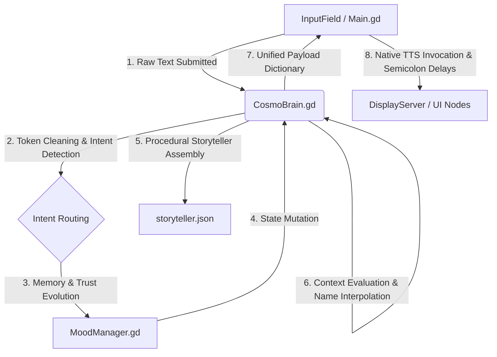

# 🪐 COSMO PROJECT (v0.5-sprint)

[](https://godotengine.org)
[](https://godotengine.org)
[](https://godotengine.org)

O **COSMO PROJECT** é um ecossistema de Inteligência Artificial Companion offline focado em comportamento emergente, processamento de intenções em tempo de execução e expressividade procedural.

O projeto apresenta uma interface facial 2D responsiva e um motor de personalidade sarcástica orquestrado por um pipeline determinístico de dados, projetado especificamente para operar nativamente na **Godot Engine 4.6 (GDScript)**.

---

# 🧠 1. Visão Geral da Arquitetura

O sistema adota uma abordagem desacoplada e baseada em dados (**Data-Driven**).  
Ele rejeita estados rígidos em favor de uma cadeia de responsabilidade reativa.

O fluxo de execução de um ciclo de input segue estritamente a topologia abaixo:



---

# 🗂️ Topologia da Cena Principal (`control.tscn`)

```text
Control (Main.gd)
├── VoicePlayer (AudioStreamPlayer)
│   └── [Legado / Gerador de onda senoidal]
│
├── BackgroundMusicPlayer (AudioStreamPlayer)
│   └── [I/O Dinâmico de arquivos .wav reais]
│
└── GameContainer (VBoxContainer)
	├── FaceContainer (CenterContainer)
	│   └── CosmoFace (AnimatedSprite2D)
	│
	├── DialogueContainer (PanelContainer)
	│   └── DialogueLabel
	│       └── [Custom Typewriter com Injeção de Meta-Tags]
	│
	└── MusicPlayerPanel (PanelContainer invisível por padrão)
		└── [Tween-driven Visibility]
			└── HBoxContainer
				└── [Alinhamento centralizado com Separation]
					├── Play / Pause / Next
					│   └── [TextureButtons funcionais conectados via sinal]
					│
					└── CurrentTrackLabel
						└── [Label para exibição do metadado limpo da faixa]
```

---

# ⚙️ 2. Mapeamento de Métodos e Contratos de APIs Interoperáveis

# `Main.gd` — Orquestrador de Ciclo de Vida e Apresentação (UI)

---

## `_on_input_field_text_submitted(_text: String) -> void`

Tranca a interface de entrada, despacha a carga textual para o `CosmoBrain`, gerencia o estado estrito de animação de pensamento (`1.2s delay tático`) e captura o payload de retorno.

Guia os componentes da interface estritamente pelo token de intenção.

Se a intenção for abrir ou fechar o player de áudio, limpa o buffer do canal concorrente de voz para evitar colisões de barramento de áudio.

---

## `_initialize_cosmo_tts() -> void`

Método executado de forma síncrona no ciclo de vida `_ready`.

Acessa o barramento do sistema operacional através de:

```gdscript
DisplayServer.tts_get_voices_for_language("pt")
```

Retornando um `PackedStringArray`.

Captura e fixa o identificador absoluto da primeira voz do subsistema local (ex: Microsoft Maria no Windows) para uso offline imediato.

---

## `execute_cosmo_reaction(speech_text: String, anim_name: String) -> void`

Motor de typewriter manual baseado em indexação assíncrona.

Analisa e limpa expressões de metadados embutidas na string:

```text
[mood:thinking]
[mood:smug]
```

Dispara a fala nativa via:

```gdscript
DisplayServer.tts_speak()
```

O loop de preenchimento (`visible_ratio`) monitora os caracteres da string totalmente limpa para forçar pausas dramáticas de escrita de forma milimétrica:

| Token | Delay |
|---|---|
| `,` | `0.30s` |
| `. ! ?` | `0.65s` |

Sem interromper o fluxo fonético linear do TTS do sistema.

---

## `_play_track(index: int) -> void`

Valida a existência física e faz o I/O em tempo de execução dos recursos externos armazenados em:

```text
res://cosmo/playlist/
```

Alimenta o stream do `bg_music_player`.

Extrai o nome do arquivo, sanitiza extensões e injeta a formatação capitalizada na UI de forma isolada, sem causar sobrescritas colaterais no contêiner principal de diálogos.

---

# `CosmoBrain.gd` — Pipeline de NLP e Persistência

---

## `detect_intent(text: String) -> String`

Sanitiza strings em tempo de execução isolando pontuações adjacentes em um array de palavras (`words`).

Executa o roteamento prioritário atômico:

```text
provide_name
→ laughter
→ music_mode
→ story_logic
→ greeting
```

O modo de música ignora estados booleanos voláteis e responde de forma determinística à presença de tokens no array de palavras.

### Processamento de Sequência Narrativa (`story_continue`)

O analisador monitora substrings nativas diretamente no texto de entrada em caixa baixa (`lower_text`).

Sentenças curtas ou compostas de continuidade:

```text
"e depois"
"o que aconteceu"
```

São interceptadas antes de caírem no fallback genérico, redirecionando o fluxo de forma fluida de volta para o motor procedural de histórias.

---

## `process_player_input(player_text: String) -> Dictionary`

Ponto de entrada do pipeline do cérebro.

Executa a cadeia de responsabilidade:

```text
Detecção de Intenção
→ Mutação de Memória
→ Mutação de Humor
→ Evolução de Confiança (Trust)
→ Interpolação de Contexto
→ I/O Serialization
```

Retorna obrigatoriamente um dicionário unificado com os contratos de API estritos esperados pela UI:

```gdscript
return {
	"text": response,
	"animation": chosen_face,
	"intent": intent
}
```

| Chave | Tipo | Descrição |
|---|---|---|
| `text` | `String` | String interpolada contendo metadados de humor |
| `animation` | `String` | Animação inicial sugerida baseada na intenção |
| `intent` | `String` | Token explícito que dita as ações físicas da UI |

---

## `generate_procedural_story() -> String`

Orquestrador de montagem de lore de alta variedade.

Sorteia frações de texto isoladas a partir de `storyteller_data`, injeta metadados visuais de ancoragem no início e no miolo da string:

```text
[mood:thinking]
[mood:smug]
```

Resolve os marcadores com o nome persistido do jogador através de `apply_context`.

---

## `_get_unique_chunk(category: String) -> String`

Mecanismo de proteção de exaustão de histórico baseado em LRU (*Least Recently Used Cache*).

Em vez de poluir o escopo global, o histórico de índices sorteados é injetado dinamicamente dentro de uma chave de cache específica da sessão no dicionário de persistência:

```gdscript
memory_data["story_history_cache"]
```

Limpa automaticamente os índices usados quando a categoria atinge o teto limite:

```gdscript
LOCAL_MAX_HISTORY = 2
```

Prevenindo loops narrativos repetitivos.

---

# 🎯 3. Arquitetura do Sistema de Lore Procedimental Combinatório

# Decisão de Design e Trade-offs

Para garantir que o produto seja:

- 100% offline
- multiplataforma
- imune a latências de rede
- livre do risco de vazamento de chaves de API

Foi abandonada qualquer dependência de LLMs comerciais baseadas em nuvem.

A variedade narrativa é gerada em tempo de execução através de um motor de Gramática Contextual Livre por blocos narrativos desacoplados.

Os diálogos, estruturas e variações de lore residem isolados no arquivo físico externo:

```text
res://cosmo/data/storyteller.json
```

---

# 📐 Modelo Matemático de Combinação Narrativa

A montagem linear segue a expressão matemática de probabilidade combinatória:

Variedade Total = ∏ |C_i| = |Intro| × |TechContext| × |TwistBug| × |Conclusion|

Com a expansão estrutural da base de dados para 12 fragmentos únicos por categoria, o sistema computa uma matriz com:

# 🎲 20.736 variações narrativas exclusivas
Escalável em runtime sem exigir nenhuma alteração lógica de código nos scripts da Godot Engine.

---

# 🛠️ 4. Práticas de Contribuição e Estilo de Código (GDScript Sênior)

## ✅ Static Typing Mandatório

Todas as funções do projeto devem conter tipagem estática estrita tanto nos argumentos quanto no retorno:

```gdscript
-> void
-> String
-> Dictionary
```

---

## ✅ Isolamento de Concorrência de Diálogos

Nenhuma função ou `Tween` paralelo está autorizado a sobrescrever as propriedades:

```text
text
visible_ratio
```

Da `DialogueLabel` central enquanto o loop assíncrono do Typewriter de uma reação ativa estiver em execução (`await`).

---

## ✅ Gerenciamento de Estados via Intenção

Elementos visuais da interface:

- exibir painéis
- ocultar contêineres
- inicializar automações de áudio

Devem ler única e exclusivamente a chave de contrato de API:

```gdscript
"intent"
```

Devolvida pelo payload do cérebro.

Comparações baseadas em varredura textual na camada de UI são explicitamente rejeitadas.

---

# 🚀 Objetivos Técnicos do Projeto

- Companion AI offline e determinístico
- Arquitetura modular Data-Driven
- Procedural Storytelling escalável
- Integração nativa com TTS do sistema operacional
- Pipeline desacoplado de intenções e humor
- Sistema de memória persistente em runtime
- UI reativa sincronizada com estados emocionais
- Compatibilidade nativa com Godot 4.6

---

# 📦 Stack Principal

| Tecnologia | Uso |
|---|---|
| Godot 4.6 | Engine principal |
| GDScript | Linguagem de scripting |
| JSON | Banco procedural de narrativa |
| DisplayServer TTS | Voz offline nativa |
| AnimatedSprite2D | Expressividade facial |
| Tween System | Transições procedurais |
| AudioStreamPlayer | Reprodução dinâmica de áudio |

---

# 🧩 Roadmap Futuro

- [ ] Emotion Graph Runtime
- [OK] Long-Term Semantic Memory
- [OK] Procedural Relationship Evolution
- [ ] Dynamic Animation Blending
- [OK] AI Mood Decay Curves
- [OK] Advanced Lore Persistence
- [ ] Runtime Personality Mutation
- [ ] Modular Intent Packs
- [ ] Voice Emotion Simulation
- [ ] Reactive Environmental Awareness

---

# 📄 Licença

Projeto experimental e autoral focado em pesquisa de comportamento procedural, arquitetura de IA Companion offline e sistemas emergentes em Godot Engine.
